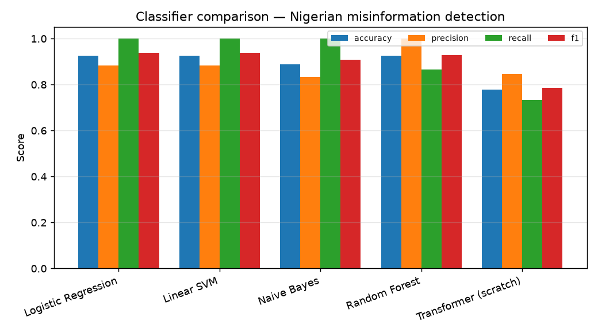

# Detecting Misinformation in Nigerian Social-Media Content

**A Machine Learning Approach — a Nigerian-context labelled dataset built from
established fact-checking sources, and a comparative evaluation of classical and
transformer-based classifiers.**

This repository contains an end-to-end, fully reproducible pipeline that

1. **constructs a Nigerian-context labelled dataset** whose claims, categories
   and verdicts mirror what established fact-checking desks
   (Africa Check, Dubawa, FactCheckHub/ICIR, PesaCheck, TheCable) actually
   report on, and
2. **trains and compares** four classical machine-learning classifiers against a
   transformer-based classifier for the binary task
   *misinformation (false / misleading) vs. credible (true)*.

```
python run.py        # builds the dataset, trains every model, writes results/
```

---

## 1. The dataset

| | |
|---|---|
| File | `data/raw/nigerian_factcheck_dataset.csv` |
| Records | 131 (71 misinformation, 60 credible) |
| Fine-grained verdicts | `false`, `misleading`, `true` |
| Binary label | `1` = misinformation (`false`\|`misleading`), `0` = credible (`true`) |
| Categories | health, elections, economy, security, politics, scam, science, education, … |
| Attributed sources | Africa Check, Dubawa, FactCheckHub, PesaCheck, TheCable, NCDC |

The corpus is themed on real Nigerian misinformation that these desks have
covered — COVID-19 "cures", 5G/vaccine conspiracies, the 2023 naira-redesign and
fuel-subsidy claims, INEC/BVAS election rumours, doctored quotes attributed to
public figures, giveaway/phishing scams, and so on — paired with genuinely true
statements (how BVAS works, what NAFDAC regulates, malaria transmission, etc.).

### Provenance & ethics — please read

The shipped CSV is a **curated, illustrative** research corpus. Each row is
written to reflect the *style, category and published verdict* of real
fact-checks, so the pipeline runs end-to-end **offline** and is reproducible by
anyone. It is **not** a scrape of any organisation's copyrighted article text.

To extend the corpus with live articles, `src/scrape.py` provides a scaffold that
parses the [`ClaimReview`](https://schema.org/ClaimReview) JSON-LD each
fact-checker embeds (the cleanest place to read a machine-readable verdict).
Respect every site's `robots.txt` and terms of use, store only what you are
permitted to (claim, verdict, URL, date), rate-limit, and attribute the source.

---

## 2. Models compared

**Classical** (`src/train_classical.py`) — TF-IDF word 1–2-grams feeding:

- Logistic Regression
- Linear SVM (probability-calibrated)
- Multinomial Naive Bayes
- Random Forest

Each is 5-fold cross-validated on the training split, then evaluated once on a
held-out, stratified 20 % test split.

**Transformer** — two paths:

- `src/train_transformer.py` — the **recommended** approach: fine-tune a
  pretrained **DistilBERT** encoder via 🤗 Transformers. *Requires access to
  `huggingface.co`.*
- `src/train_transformer_scratch.py` — a compact **Transformer encoder built and
  trained from scratch** in PyTorch (token + positional embeddings → multi-head
  self-attention layers → mean-pool → linear head). Needs **no** downloads, so it
  always runs.

> **Environment note.** In the execution environment used to produce the results
> below, the model hub (`huggingface.co`) is blocked by the network egress
> policy, so pretrained DistilBERT weights could **not** be downloaded. The
> runner detects this, skips the pretrained path gracefully, and reports the
> **from-scratch** transformer instead. Re-run `python src/train_transformer.py`
> in an environment with hub access to add the fine-tuned DistilBERT row.

---

## 3. Results

Held-out test set (27 examples), reproduced by `python run.py`
(`results/summary_table.txt`):

| Model | Accuracy | Precision | Recall | F1 | Macro-F1 | ROC-AUC |
|---|---:|---:|---:|---:|---:|---:|
| Logistic Regression | 0.926 | 0.882 | 1.000 | 0.938 | 0.923 | 0.967 |
| Linear SVM | 0.926 | 0.882 | 1.000 | 0.938 | 0.923 | 0.967 |
| Naive Bayes | 0.889 | 0.833 | 1.000 | 0.909 | 0.883 | 0.950 |
| **Random Forest** | **0.926** | **1.000** | 0.867 | 0.929 | **0.926** | **0.994** |
| Transformer (from scratch) | 0.778 | 0.846 | 0.733 | 0.786 | 0.777 | 0.894 |



### Reading the results honestly

- On this small, lexically-distinctive corpus, the **classical TF-IDF baselines
  win** — Random Forest and the linear models reach ≈0.92–0.93 macro-F1. The
  linear models catch **every** misinformation item (recall = 1.0); Random Forest
  trades a little recall for perfect precision.
- The **from-scratch transformer trails** (≈0.78 macro-F1). This is the
  *expected* outcome, not a bug: a transformer initialised from random weights
  has no linguistic prior and a few hundred short examples are far too few for it
  to learn one. Its strength — contextual representation — only pays off with
  **large-scale pretraining** (the DistilBERT path) or a **much larger dataset**.
- **Takeaway for practitioners:** for a modest, domain-specific misinformation
  corpus, a well-regularised TF-IDF + linear/tree model is a strong, cheap,
  interpretable baseline; transformers are worth the cost mainly when you can
  fine-tune a *pretrained* one or supply substantially more labelled data.

Confusion matrices for every model are in `results/figures/`.

---

## 4. Live web demo (Vercel)

A tiny, self-contained web demo lets you paste a claim and see the model's
verdict, probability and the n-grams driving it:

```
api/index.py     # pure-Python (stdlib only) serverless handler + HTML page
api/model.json   # the TF-IDF + LogReg model exported to ~19 KB of JSON
vercel.json      # routes / and /api/predict to the function
```

The winning **Logistic Regression** pipeline is exported to plain JSON by
`src/export_web_model.py`, and inference is re-implemented in pure Python — its
output matches scikit-learn to machine precision (parity check `max |Δp| ≈ 2e-16`).
This means the serverless function needs **no** numpy / scikit-learn / torch, so
it deploys within Vercel's size limits and starts instantly. `.vercelignore`
excludes the training stack from the deployment. The demo is educational and is
**not** a verdict on any real-world claim.

```
POST /api/predict   {"text": "..."}  ->  {label, probability_misinformation, top_signals, ...}
```

Run it locally:

```bash
python -m http.server  # not this — use the handler directly:
python -c "import sys; sys.path.insert(0,'api'); from http.server import HTTPServer; import index; HTTPServer(('127.0.0.1',8000), index.handler).serve_forever()"
# then open http://127.0.0.1:8000/
```

---

## 5. Repository layout

```
├── run.py                        # one-command end-to-end pipeline
├── requirements.txt
├── data/
│   ├── raw/nigerian_factcheck_dataset.csv    # the curated dataset
│   └── processed/                            # train/test split (regenerated)
├── src/
│   ├── dataset.py                # builds the labelled corpus (+ integrity checks)
│   ├── preprocess.py             # cleaning + stratified split
│   ├── train_classical.py        # TF-IDF + 4 classical models
│   ├── train_transformer.py      # fine-tune pretrained DistilBERT (needs HF hub)
│   ├── train_transformer_scratch.py  # from-scratch PyTorch transformer
│   ├── evaluate.py               # metrics, confusion matrices, comparison plot
│   ├── export_web_model.py       # export LogReg -> web/model JSON (+ parity check)
│   └── scrape.py                 # ClaimReview scraping scaffold (opt-in)
├── api/
│   ├── index.py                  # pure-Python serverless demo (Vercel)
│   └── model.json                # exported ~19 KB model
├── vercel.json / .vercelignore   # deploy config (lean, no heavy deps)
└── results/
    ├── metrics/                  # per-model + combined JSON
    ├── figures/                  # confusion matrices + comparison bar chart
    └── summary_table.txt         # the table above
```

## 6. Reproduce

```bash
pip install -r requirements.txt
python run.py                         # full pipeline
# individual stages:
python src/dataset.py                 # rebuild the dataset
python src/train_classical.py         # classical models only
python src/train_transformer_scratch.py   # from-scratch transformer
python src/train_transformer.py       # fine-tune DistilBERT (needs huggingface.co)
```

All randomness is seeded (`random_state = 42`) so runs are deterministic.

## 7. Limitations & next steps

- **Dataset size and provenance.** 131 curated items are enough to demonstrate
  and compare the pipeline, not to ship a production detector. Use `src/scrape.py`
  to grow the corpus from live `ClaimReview` data (respecting each site's terms),
  and add Pidgin/Hausa/Yoruba/Igbo code-mixed examples that Nigerian social media
  actually contains.
- **Fine-tuned transformer.** Run the DistilBERT path where the model hub is
  reachable; an AfriBERTa / AfroXLMR checkpoint would better match Nigerian
  languages and code-switching.
- **Evaluation.** With more data, move to k-fold or temporal splits and report
  confidence intervals; the current 27-example test set makes single-run point
  estimates noisy.
